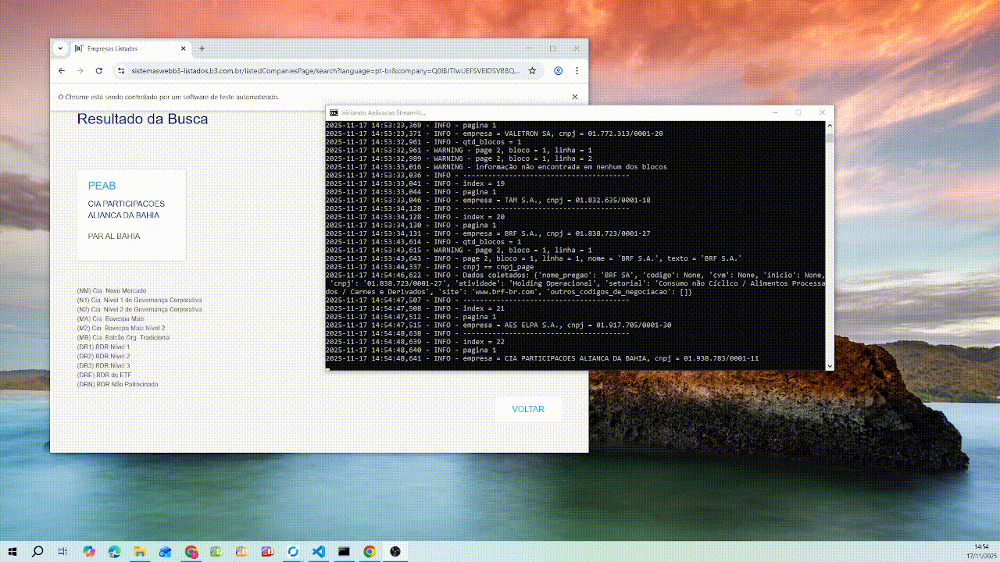
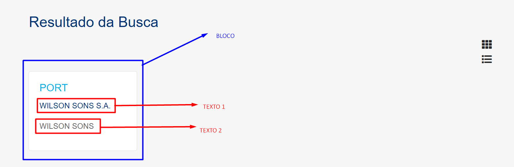

# **B3 Companies Page**

Pipeline que acessa a página pública da B3 para **consultar empresas** e **coletar todas as informações exibidas** sobre cada companhia.

O pipeline **precisa de uma base contendo o nome da empresa e o CNPJ**.
No exemplo do projeto, foi usada a lista de empresas com balanço patrimonial registrado na CVM, mas **o cliente pode usar qualquer base**, desde que tenha **nome** e **CNPJ**.

**Fonte oficial da consulta:**
[https://sistemaswebb3-listados.b3.com.br/listedCompaniesPage/?language=pt-br](https://sistemaswebb3-listados.b3.com.br/listedCompaniesPage/?language=pt-br)

## Limitações

Nesse exemplo, o script não conseguiu selecionar o `bloco` porque o nome informado foi `PORTO SERVIÇO S.A`.
O script percorre as duas linhas (1 e 2) de cada bloco e compara o texto encontrado.
Se o nome for igual ao texto do bloco, ele seleciona; caso contrário, continua o loop até verificar todos os blocos.

Ou seja, mesmo que as informações estejam disponíveis na página, a correta seleção do bloco depende inteiramente da base fornecida pelo cliente.
Se o nome informado não corresponder exatamente ao que aparece na B3, o script não consegue identificar o bloco correto, o que compromete a automação e inviabiliza garantir 100% de precisão na coleta.